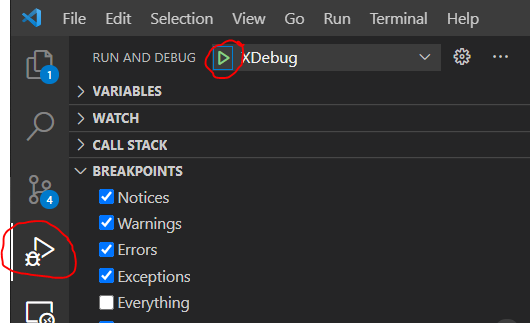

# Language Forge #

[Language Forge](https://languageforge.org) is an online service to collaborate on building a dictionary.

## Users ##

To use **Language Forge** go to [languageforge.org](https://languageforge.org).

### User Problems ###

To report an issue using the **Language Forge** service, email "languageforgeissues @ sil dot org".

## Special Thanks To ##

 for end-to-end test automation.

[](https://bugsnag.com/blog/bugsnag-loves-open-source) for error reporting.

## Developers ##

We use [Gitflow](http://nvie.com/posts/a-successful-git-branching-model/) with two modifications:

- The Gitflow **master** branch is our **live** branch.
- The Gitflow **develop** branch is our **master** branch. All pull requests go against **master**.

We merge from **master** to testing (**qa** branch) then ship to **live**.

| Master Branch | QA/Staging Branch | Live/Production Branch |
| ------------- | --------- | ----------- |
| `master` | `lf-qa` | `lf-live` |

### CI Builds ###

Status of builds from our continuous integration (CI) [server](https://build.palaso.org):

| PHP Unit Tests | E2E Tests | Staging | Production |
| ----------- | ---------- | -- | ---- |
| [](https://build.palaso.org/buildConfiguration/LanguageForgeDocker_PhpTests) | [](https://build.palaso.org/buildConfiguration/LanguageForgeDocker_E2eTests) | [](https://build.palaso.org/buildConfiguration/LanguageForge_LanguageForgeQa) | [](https://build.palaso.org/buildConfiguration/xForgeDeploy_LanguageForgeLiveBionic) |

### Deployed Sites ###

| Staging | Production |
| -- | ---- |
| [qa.languageforge.org](https://qa.languageforge.org) | [languageforge.org](https://languageforge.org) |

## Style Guides ##

PHP code conforms to [PSR-2](http://www.php-fig.org/psr/psr-2/).

- Add `php-cs-fixer` globally installed with *composer* (http://cs.sensiolabs.org/). Here is how to add it to **PhpStorm** (https://hackernoon.com/how-to-configure-phpstorm-to-use-php-cs-fixer-1844991e521f). Use it with the parameters `fix --verbose "$FileDir$/$FileName$"`.

JavaScript code conforms to [AirBNB JS style guide](https://github.com/airbnb/javascript).

- Using PhpStorm with JSCS helps a lot with automating this (see the section below on PhpStorm [Coding Standard and Style](#coding-standard-and-style)).

### TypeScript Style Guide ###

Our code base has moved from JavaScript to [**TypeScript**](https://www.typescriptlang.org).

> Note: this repo is currently AngularJS (1.8) not Angular (2+).

Our TypeScript follows the [Angular Style Guide](https://angular.io/guide/styleguide). This is opinionated not only about things like file name conventions but also file and folder structure. This is an appropriate time to change structure and file names since most file contents will be changed anyway. The reason for following this is to make it easier, not only for new developers to the project (like the FLEx team and hired developers) but also to change to Angular (2+) later.

To this end you'll also want to be familiar with [Upgrading from AngularJS](https://angular.io/guide/upgrade) particularly the [Preparation](https://angular.io/guide/upgrade#preparation) section.

We are expecting that TypeScript will help us get things right from the beginning (catching things even as you type) as well as maintenance. We are expecting that it will be an easier transition for the FLEx team and that they will be able to help us with good typing, interfaces and class design.

Other useful resources:

- [x] [angularjs-styleguide/typescript at master · toddmotto/angularjs-styleguide](https://github.com/toddmotto/angularjs-styleguide/tree/master/typescript#stateless-components)
- [x] [AngularJS 1.x with TypeScript (or ES6) Best Practices by Martin McWhorter on CodePen](https://codepen.io/martinmcwhorter/post/angularjs-1-x-with-typescript-or-es6-best-practices)
- [x] [What is best practice to create an AngularJS 1.5 component in Typescript? - Stack Overflow](https://stackoverflow.com/questions/35451652/what-is-best-practice-to-create-an-angularjs-1-5-component-in-typescript)
- [x] [Don't Panic: Using ui-router as a Component Router](http://dontpanic.42.nl/2016/07/using-ui-router-as-component-router.html)
- [x] [Lifecycle hooks in Angular 1.5](https://toddmotto.com/angular-1-5-lifecycle-hooks#onchanges)

## Docker Development Environment ##

1. Install [Docker](https://www.docker.com/get-started) (Linux users will need some additional steps, please visit https://docs.docker.com/compose/install for info on install the engine and compose)
1. Install [Make](https://www.gnu.org/software/make/).  This is actually optional but simplifies things a bit.
1. Clone the repo:  `git clone https://github.com/sillsdev/web-languageforge`
1. `cd web-languageforge/docker`

### Running the App Locally

1. `make`
1. Within any browser, navigate to https://localhost
1. Continue through any certificate warnings
1. You should see a landing page, click "Login"
1. Use `admin` and `password` to get in

### Running E2E Tests

1. `make e2e-tests`
1. Individual test results will appear in your terminal but if you'd like to watch them in real-time, simply VNC into the running tests via `localhost:5900`, e.g., Mac OSX users simply `open vnc://localhost:5900` and use `secret` as the password.  Other operating systems may require installing a separate VNC Viewer tool.

### Running Unit Tests

1. `make unit-tests`
1. Test results will appear in your terminal

### Viewing logs

1. `make logs` will show logs from any running containers, results can be filtered by simply grepping, e.g., `make logs | grep lf-ui-builder`

### Cleanup

1. `make clean` is the most common, it shuts down and cleans up running containers
1. less commonly, if you need to blow away shared artifacts from previous runs, simply `make clean-volumes`
1. rarely needed but for a "start from scratch" environment, `make clean-powerwash`.

### Running dev

1. `make dev` will start the app in development mode, i.e. changes to source code will immediately be reflected in the locally running app.

### Building for production

1. `make prod` will build a production version of the app.

### LiveReload ###

### LiveReload Chrome extension ####

Install the [LiveReload](https://chrome.google.com/webstore/detail/livereload/jnihajbhpnppcggbcgedagnkighmdlei?hl=en-US) extension.

### Visual Studio Code ###

Visual Studio Code is a simple, free, cross-platform code editor. You can download VS Code from [here](https://code.visualstudio.com/).

The first time you open VS Code in the `web-languageforge` directory, it will recommend a list of extensions that are useful for developing Language Forge.  Install all recommended extensions for the best experience.

Chrome and PHP debugging have also been configured. Launch configurations are defined in the `.vscode/launch.json` file.

## Debugging ##

### PHP Application Debugging ###

To debug the Language Forge application locally, follow these steps:
- run `make` or `make dev`
- In VS Code, set a breakpoint on a line of code that should be executed
- Click on the `Run and Debug` area of VS Code, then click the green play icon next to `XDebug` in the configuration dropdown.
] 
- The VSCode status bar will turn orange when XDebug is active

Additional considerations:

If you encounter errors such as VSCode cannot find a file in the path "vendor", these source files are not available to VSCode as they are running inside Docker.  If you want to debug vendor libraries (not required), you will have to use Composer to download them put them in your source tree.


### E2E Tests - TODO Needs Updating/Review ###
To test a certain test spec, add a parameter `--specs [spec name]`.  For example,

``` bash
./rune2e.sh lf --specs lexicon-new-project
```

will run the the *lexicon-new-project.e2e-spec.ts* tests on **languageforge**.

To debug the tests:
- Do at least one of the following:
  * If you are going to debug in VSCode, place breakpoints in the tests.
  * Place breakpoints in your code (`debugger;` statements).
  * To pause the debugger on the first test failure, go to `test/app/protractorConf.js` and uncomment the line that adds the `pauseOnFailure` reporter.
- Start the tests with `./rune2e.sh`. Wait for the tests to actually start running before moving to the next steps.
- To debug in Chrome, go to `chrome://inspect/#devices`. Under "Remote Target" click to inspect the Node.js process.
- To debug in VSCode, select the "Node debugger" debug configuration and run it.
## Libraries Used ##

[lamejs](https://github.com/zhuker/lamejs) is used for encoding recorded audio and is based on [LAME](http://lame.sourceforge.net/), which is licensed under the terms of [the LGPL](https://www.gnu.org/licenses/old-licenses/lgpl-2.0.html).
