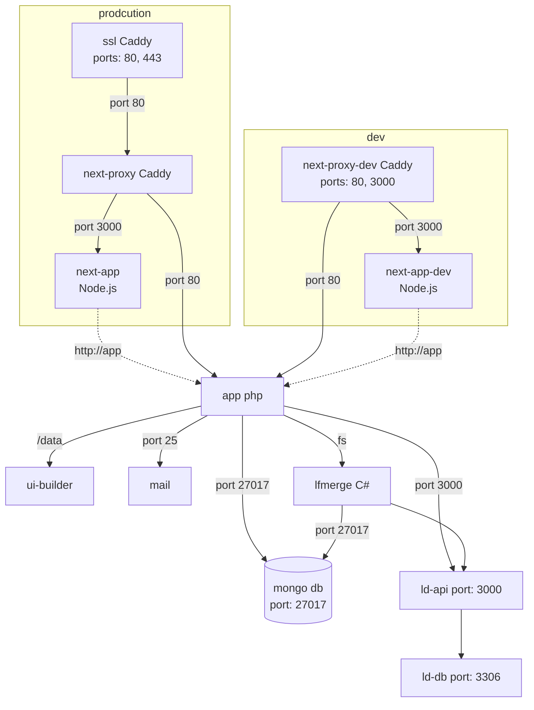
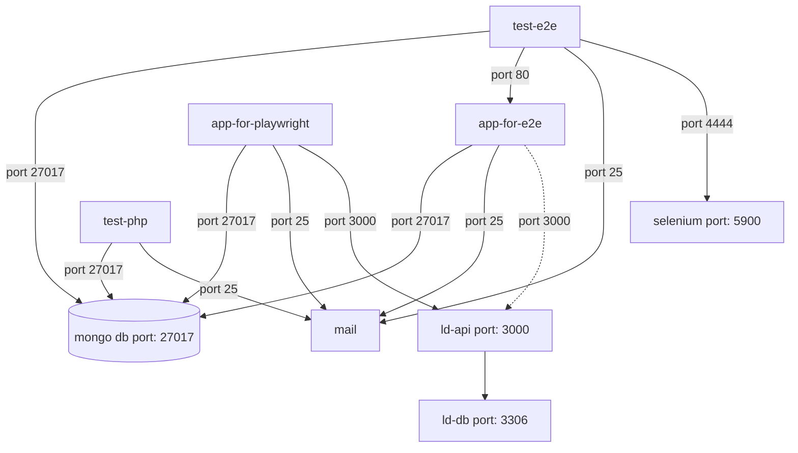

Docker services diagram (dev)

dashed line means it connects but the service does not depend on the next container

```mermaid
%%{init: {'flowchart': {'curve': 'basis'}}}%%
flowchart TB
    ui-builder
    app[app php]
    app -- port 27017 --> db
    app -- port 25 --> mail
    app -- port 3000 --> ld-api
    app -- fs --> lfmerge
    app -- /data --> ui-builder

    lfmerge[lfmerge C#]
    lfmerge -- port 27017 --> db
    lfmerge --> ld-api

    subgraph prodcution
        ssl[ssl Caddy \n ports: 80, 443]
        ssl -- port 80 --> next-proxy

        next-proxy[next-proxy Caddy]
        next-proxy -- port 3000 --> next-app

        next-app[next-app \n Node.js]
    end

    next-app -. http://app .-> app
    next-proxy -- port 80 --> app

    subgraph dev
        next-proxy-dev[next-proxy-dev Caddy \n ports: 80, 3000]
        next-proxy-dev -- port 3000 --> next-app-dev

        next-app-dev[next-app-dev \n Node.js]
    end

    next-proxy-dev -- port 80 --> app
    next-app-dev -. http://app .-> app

    mail
    db[(mongo db \n port: 27017)]
    ld-db[ld-db port: 3306]
    ld-api[ld-api port: 3000]
    ld-api --> ld-db
```

Testing diagram

```mermaid
%%{init: {'flowchart': {'curve': 'basis'}}}%%
flowchart TB

    mail
    db[(mongo db port: 27017)]
    selenium[selenium port: 5900]
    ld-db[ld-db port: 3306]
    ld-api[ld-api port: 3000]
    ld-api --> ld-db

    test-e2e
    test-e2e -- port 27017 --> db
    test-e2e -- port 80 --> app-for-e2e
    test-e2e -- port 25 --> mail
    test-e2e -- port 4444 ---> selenium

    app-for-e2e
    app-for-e2e -- port 27017 ---> db
    app-for-e2e -- port 25 ---> mail
    app-for-e2e -. port 3000 ..-> ld-api

    app-for-playwright
    app-for-playwright -- port 27017 ---> db
    app-for-playwright -- port 25 ---> mail
    app-for-playwright -- port 3000 ---> ld-api

    test-php
    test-php -- port 27017 --> db
    test-php -- port 25 --> mail

```
