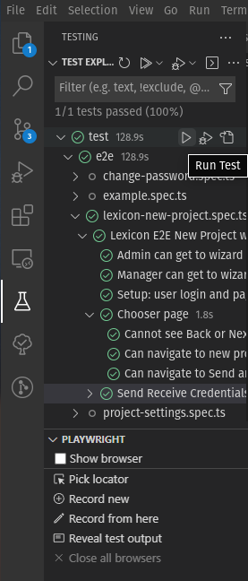
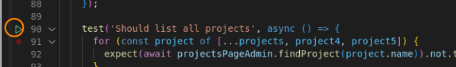
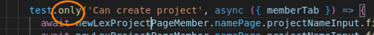
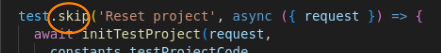

# Playwright Cheatsheet - run and debug tests

## Most simple

1. install VSCode Extension: [_Playwright Test for VSCode_](https://marketplace.visualstudio.com/items?itemName=ms-playwright.playwright)
2. `make`
3. run tests directly with the extension in the side bar
4. 
5. or run tests directly from the spec files

### Debug tests

- debug tests by setting breakpoints in VSCode and select (right click on green triangle) _Debug Test_

## Simple

1. `make e2e-tests`
   This commands executes the playwright tests. Execution is specified in the makefile.

## More options

### Setup

1. `make`
1. `cd ..`
1. `npx playwright test`

### Options

- run only a specific test file: `npx playwright test project.spec.ts`
- run only a specific test: add `.only` to the test
   - only tests which have the `.only` will be executed (one can add `.only` to multiple tests)
- view how the tests are run: `npx playwright test --headed`
- step through the single lines, clicking _next_ : `npx playwright test --debug`

## Essential to know

1. delete all _storageState.json_ files before running the tests: `rm *storageState*`
1. not all tests will be executed but Playwright will indicate how many were executed or skipped, e.g., _4 skipped_, _50 passed_. Tests are skipped when they are ought to be skipped (see screenshot below, `.skip`) or when something goes wrong, e.g. an error in the beforeAll leads to all tests of this block being skipped.

